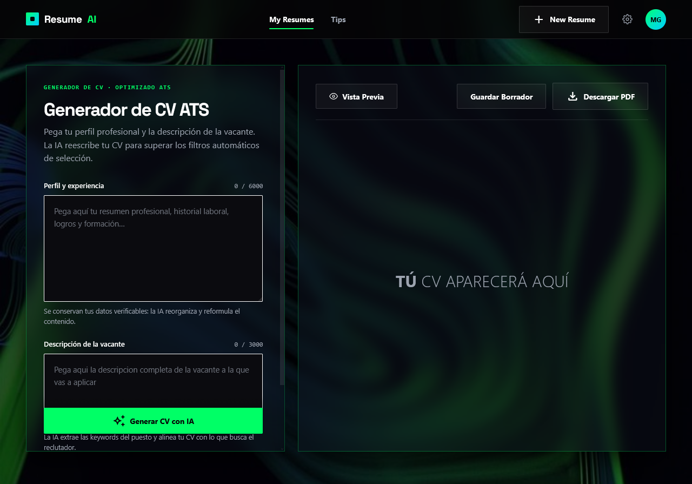
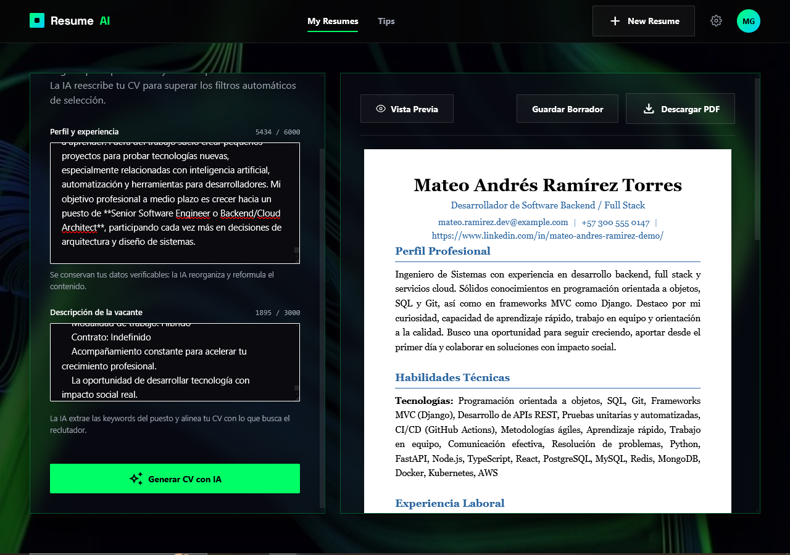
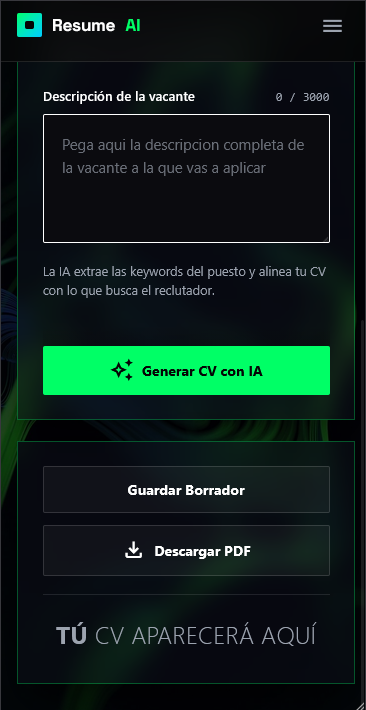

# 🎨 CV AI — Generador de Hojas de Vida con Inteligencia Artificial

> Crea una hoja de vida profesional describiendo tu trayectoria en lenguaje natural.

**CV AI** es una aplicación frontend que utiliza **inteligencia artificial** para transformar tu perfil profesional y una vacante en un CV estructurado y listo para superar los filtros ATS.

En lugar de llenar un formulario tradicional campo por campo, describes tu **perfil y experiencia** y pegas la **descripción de la vacante**. La aplicación analiza la información, la estructura en las secciones apropiadas del CV y presenta el resultado a través de una interfaz profesional con vista previa en tiempo real y descarga en PDF.

---

## 📸 Vista previa




---

## ✨ Características

- 🤖 **Generación de CV con IA:** la IA reescribe y reorganiza tu información automáticamente.
- 💬 **Entrada en lenguaje natural:** pega tu perfil y la vacante sin preocuparte por la estructura.
- 🎯 **Optimizado para ATS:** la IA extrae las keywords de la vacante y alinea tu CV con lo que busca el reclutador.
- 🧠 **Extracción y estructuración automática** de la información en secciones:
  - 👤 Datos personales (nombre, título, contacto, LinkedIn)
  - 📝 Perfil profesional
  - 💼 Experiencia laboral y logros
  - 🚀 Proyectos destacados
  - 🛠️ Habilidades técnicas
  - 🎓 Educación
  - 🌎 Idiomas y nivel de dominio
- 🔁 **Reintentos automáticos:** si el servicio de IA está saturado (HTTP 503), la app reintenta con espera progresiva (backoff exponencial).
- 👀 **Vista previa en tiempo real:** el CV se renderiza al instante en un formato tipo documento A4.
- 📄 **Descarga en PDF:** exporta el CV optimizado en un clic.
- 📱 **Diseño responsivo:** experiencia optimizada en escritorio, tablet y móvil.
- 🌑 **Interfaz moderna:** tema oscuro con acentos neón, glassmorphism y animaciones suaves.
- 🔔 **Notificaciones toast** para estados de carga, éxito y error.

---

## 💡 Cómo funciona

La idea detrás de **CV AI** es simple:

> El usuario no debe complicarse en cómo estructurar su CV. Solo debe explicar su experiencia profesional de forma natural.

El flujo general es el siguiente:

```text
Usuario
  │
  ▼
Entrada en lenguaje natural (perfil + vacante)
  │
  ▼
Procesamiento con IA
  │
  ▼
Extracción de información
  │
  ├── Datos personales
  ├── Perfil profesional
  ├── Educación
  ├── Experiencia laboral
  ├── Proyectos
  ├── Habilidades
  ├── Idiomas
  └── Orientación profesional
  │
  ▼
Datos estructurados del CV (JSON)
  │
  ▼
Vista previa del CV (formato A4)
  │
  ▼
Descarga en PDF
```

La comunicación con el backend se realiza mediante dos endpoints:

| Endpoint | Método | Descripción |
| --- | --- | --- |
| `/generate-cv` | `POST` | Envía `{ datos, vacante }` y recibe el CV optimizado como JSON. |
| `/download-pdf` | `POST` | Envía el JSON del CV y descarga el archivo PDF generado. |

---

## 🛠️ Stack tecnológico

| Tecnología | Uso |
| --- | --- |
| [React 19](https://react.dev/) | Framework de interfaz de usuario. |
| [Vite 8](https://vite.dev/) | Bundler y servidor de desarrollo. |
| [TypeScript](https://www.typescriptlang.org/) | Tipado estricto en todo el código. |
| [Tailwind CSS 4](https://tailwindcss.com/) | Estilos y diseño responsive. |
| [Axios](https://axios-http.com/) | Cliente HTTP para la comunicación con la API. |
| [react-hot-toast](https://react-hot-toast.com/) | Notificaciones. |

---

## 📁 Estructura del proyecto

```text
src/
├── components/
│   ├── ui/                  # Componentes base reutilizables (Boton, TextArea).
│   ├── layuot/              # Paneles de la aplicación:
│   │   ├── Header.tsx           # Barra superior sticky (con menú hamburguesa móvil).
│   │   ├── CenterPanel.tsx      # Formulario: perfil + descripción de la vacante.
│   │   ├── RightPanel.tsx       # Vista previa del CV y acciones (descargar PDF).
│   │   └── Tips.tsx             # Modal con consejos para mejores resultados.
│   └── cvComponents/        # Secciones que renderizan el CV:
│       ├── HeaderCV.tsx         # Datos personales.
│       ├── AboutMe.tsx          # Perfil profesional.
│       ├── Habilidades.tsx      # Habilidades técnicas.
│       ├── Experiencia.tsx      # Experiencia laboral y proyectos.
│       └── Educacion.tsx        # Educación e idiomas.
├── hooks/
│   ├── useFetchAI.tsx       # Lógica de generación del CV con reintentos.
│   └── useFechtPDF.tsx      # Lógica de descarga del PDF.
├── types/
│   └── cv.ts                # Interfaces TypeScript que definen el contrato del CV.
├── App.tsx                  # Componente principal que orquesta el estado global.
├── main.tsx                 # Punto de entrada.
└── style.css                # Estilos globales y tokens de diseño.
```

---

## 🚀 Instalación y uso en local

### Requisitos previos

- [Node.js](https://nodejs.org/) 18 o superior.
- El **backend** de la API corriendo (los endpoints `/generate-cv` y `/download-pdf`).

### Pasos

1. **Clona o descarga** este repositorio y abre la carpeta del proyecto.

2. **Instala las dependencias:**

   ```bash
   npm install
   ```

3. **Configura las variables de entorno.** Crea un archivo `.env` en la raíz con las rutas de tu API:

   ```env
   # URL para enviar los datos y obtener el JSON optimizado por la IA
   VITE_API_URL_AI=http://localhost:3900/api/generate-cv

   # URL para enviar el JSON listo y descargar el archivo PDF
   VITE_API_URL_PDF=http://localhost:3900/api/download-pdf
   ```

4. **Levanta el servidor de desarrollo:**

   ```bash
   npm run dev
   ```

5. Abre tu navegador en la dirección que indique la consola (normalmente `http://localhost:5173`).

---

## 📜 Scripts disponibles

| Comando | Descripción |
| --- | --- |
| `npm run dev` | Inicia el servidor de desarrollo (Vite). |
| `npm run build` | Compila TypeScript y genera la versión de producción. |
| `npm run lint` | Ejecuta ESLint sobre el proyecto. |
| `npm run preview` | Previsualiza la compilación de producción. |

---

## 🖱️ Uso de la aplicación

1. **Pega tu perfil y experiencia** en el campo correspondiente del panel izquierdo (resumen profesional, historial laboral, logros, formación…).
2. **Pega la descripción completa de la vacante** a la que vas a aplicar.
3. Haz clic en **“Generar CV con IA”**. La aplicación muestra el progreso y reintenta automáticamente si el servicio está saturado.
4. Revisa el resultado en la **vista previa** del panel derecho (formato documento).
5. Haz clic en **“Descargar PDF”** para exportar tu CV optimizado.

> 💡 El botón **"Tips"** del encabezado muestra consejos para que la IA genere mejores resultados.

---

## 📱 Capturas de pantalla


---




---




---

## 🤝 Contribuciones

Las contribuciones son bienvenidas. Para cambios importantes, abre primero un *issue* para discutir qué te gustaría cambiar. Asegúrate de que `npm run lint` y `npm run build` pasen sin errores.

---

## 📄 Licencia

Este proyecto es de uso privado. Consulta al mantenedor para más información.
